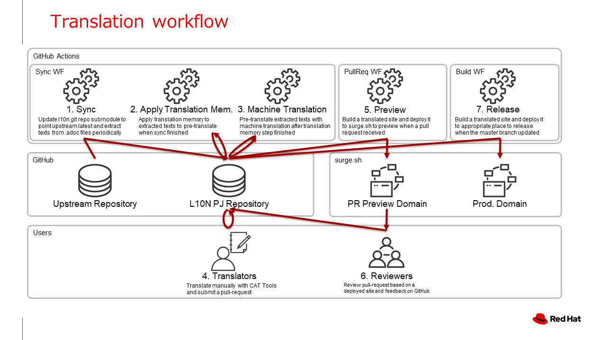

# ja.quarkus.io

Japanese Localization project for [https://github.com/quarkusio/quarkusio.github.io](https://github.com/quarkusio/quarkusio.github.io) (The repository for [quarkus.io website](https://quarkus.io))

Localized site: [https://ja.quarkus.io/](https://ja.quarkus.io)

## Localization architecture

The original site [quarkusio.github.io](https://github.com/quarkusio/quarkusio.github.io) is built with Jekyll, 
and most of its contents are written in asciidoctor (.adoc) files.
ja.quarkus.io extracts texts from the original site to .po files with [po4a](https://po4a.org/) utility.
Once translators translate the extracted messages in the .po files,
ja.quarkus.io writes back to .adoc files, and builds a localized site.
Most workflow including pre-translation by DeepL API are automated by GitHub Actions. 
Translators can focus on post-editing to improve fluency.
If you are interested in contributing localization, please edit .po files, and submit a pull request.



### .adoc files localization

#### sync workflow

ja.quarkus.io GitHub repository has a GitHub Actions workflow which checks upstream repository(submodule) update, 
extracts texts from upstream .adoc files to [.adoc.po files](l10n/po), pre-translate with a translation memory 
and the DeepL API.

#### Translating .po files

.po files in [l10n/po](l10n/po) directory need to be translated. 
.po file is a file format commonly used for software internationalization, and many CAT software and SaaS can read/write.
[POEdit](https://poedit.net/), which runs on Windows/Mac/Linux is a good candidate.
Since .po files are pre-filled with machine translation with "fuzzy" mark, 
please remove "fuzzy" mark and correct inappropriate sentences if needed.

#### Build a localized site

When you send a pull-request, GitHub Actions workflow automatically applies translations in .po files to .adoc files,
build a localized site and deploys it to surge.sh with preview domain. When the deploy finish, GitHub Actions comment 
the URL to the pull-request. Reviewers can check the deployed site for review.
When the pull-request is merged into `master`, it is automatically deployed to the production site (https://ja.quarkus.io).


### Local build

If you would like to build a site in your local environment, first you need to install some tools.
`bin/setup-build-env-on-ubuntu` is a silent setup script for GitHub Actions(Ubuntu).
Please install tools by just executing it, or execute equivalent your package manager commands.
```
bin/setup-build-env-on-ubuntu
```
After that, run the following command to build the site. 
```
vendor/quarkus-l10n-utils/bin/build
```
The site is built in `doc` directory.

You can start local server to preview the site.
```
vendor/quarkus-l10n-utils/bin/exec-jekyll-serve
```

### HTML templates localization

Most contents of [quarkus.io](https://quarkus.io) are in .adoc files, but a few texts are in its HTML templates.
Since HTML templates cannot be parsed with [po4a](https://po4a.org/) utility, this localization project repository has its
localized copies in the [l10n/override](l10n/override) directory. When the templates in the upstream repository are 
updated, GitHub Actions workflow automatically creates an issue to let you know. 
Please refer the [l10n/stats/override.csv](l10n/stats/override.csv) to check which files are updated, and update the override files 
to keep it up to date.

## FAQ

### Some guides or blog posts are not translated.

These articles are not translated, but don't worry. Machine-translation is available in the corresponding .adoc.po file.
We'll appreciate if you post-edit the .adoc.po files to polish up, remove "fuzzy" mark, and send a pull-request.

### Some sentences are not translated in the translated articles

It seems corresponding upstream sentences are updated, and completed translations are not available. 
We'll appreciate if you post-edit the corresponding .adoc.po files to polish up, remove "fuzzy" mark, and send a pull-request.

## Contributing

Submitting a pull request, and reporting an issue are all welcome.

For translators, we have a [translation guide(ja)](./translation-guide.ja.md).

## License

ja.quarkus.io is Open Source Project released under the
[Apache 2.0 license](http://www.apache.org/licenses/LICENSE-2.0.html).
